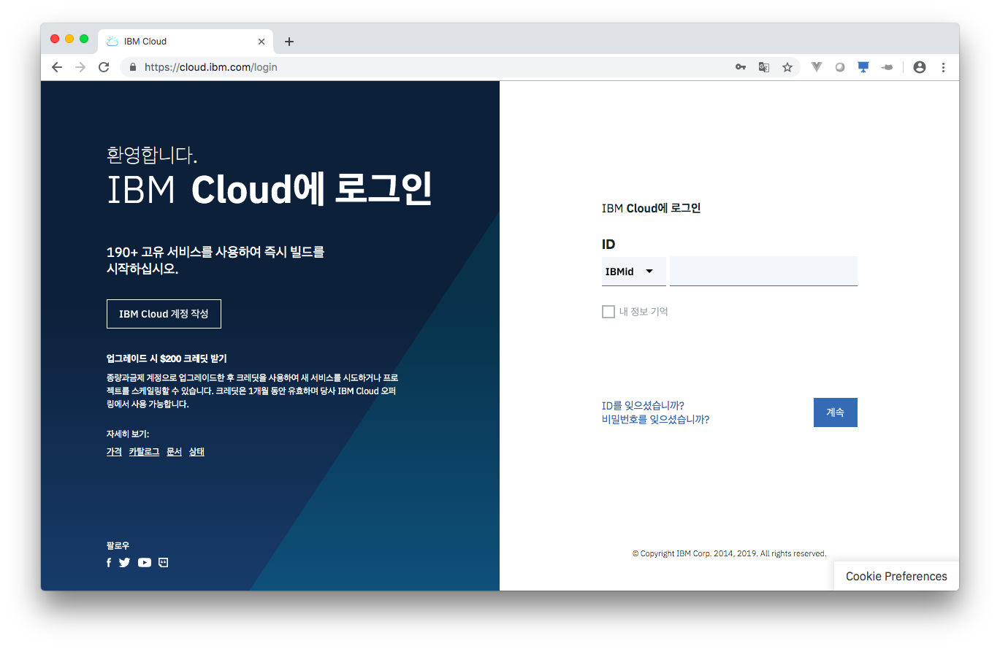
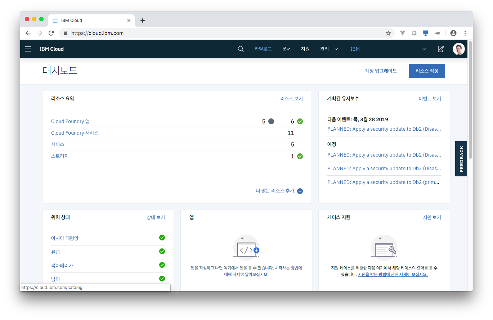
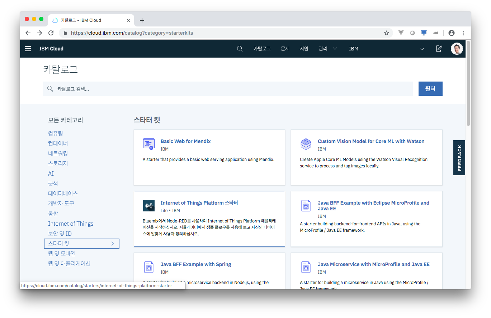
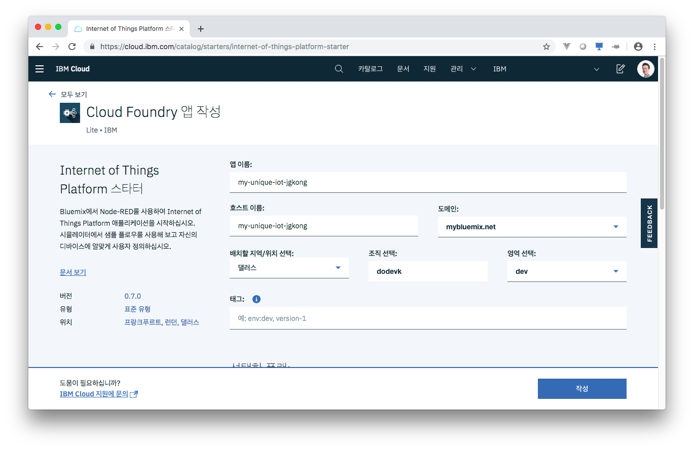
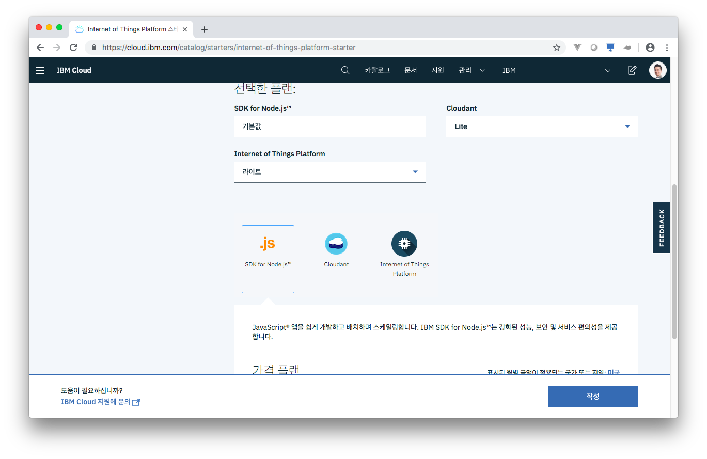

# IoT Platform 스타터킷 시작하기

1. IBM 클라우드 콘솔 https://cloud.ibm.com/ 에 접속하여 로그인합니다.
    
2. 위 메뉴의 `카탈로그`를 클릭하여 카탈로그로 들어갑니다.
    
3. 왼쪽 `모든 카테고리`에서 `스타터 킷`을 선택하고 `Internet of Things Platform 스타터` 를 선택합니다.
    * 주의 - 전에 생성한 다른 IoT Platform 서비스나, 클라우던트 서비스가 있다면 삭제 후 진행해야 합니다.
    
4. 배치 지역은 `댈러스`를 선택합니다. 앱 이름과 호스트 이름은 기본적으로 같이 입력되며, 다른 사람이나 서비스와 겹치지 않을 이름을 입력해줍니다.
    
5. 플랜은 `기본값`, `Lite`, `라이트` 로 선택하면 무료 계정인 라이트 계정에서도 사용할 수 있으며, 신용카드를 입력한 일반 계정에서도 과금되지 않습니다. 다만 같은 서비스의 Lite 플랜은 한 계정에 한개만 만들 수 있으므로, 다른 서비스가 있다면 삭제해주어야 합니다. 선택에 문제가 없다면 `작성`을 클릭하여 스타터 킷을 작성합니다.
    
6. 스타터 킷은 서비스와 연동해 볼 수 있는 코드를 런타임에 쉽게 올려볼 수 있게 도와줍니다. 약 5분에서 15분 정도 기다리면 서비스가 준비됩니다.
